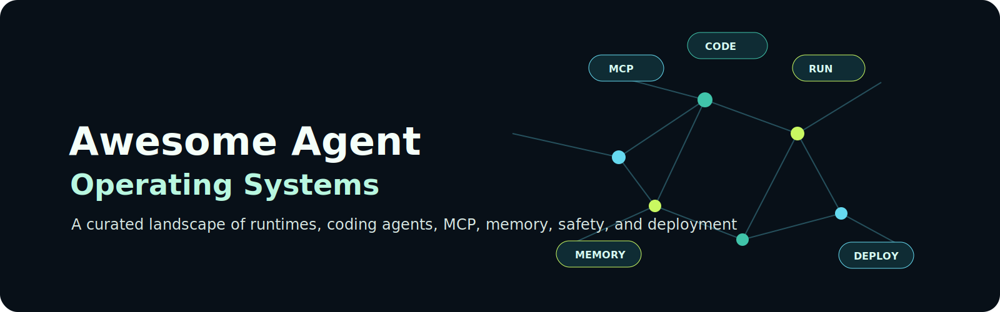

  

<h1 align="center">Awesome Agent Operating Systems</h1>

  <strong>A curated landscape of runtimes, coding agents, MCP, memory, safety, deployment, and managed agent platforms.</strong>

  <a href="#top-picks-by-job">Top Picks</a> ·
  <a href="docs/landscape-map.md">Landscape Map</a> ·
  <a href="docs/frankxai-awesome-repos-audit.md">FrankX Audit</a> ·
  <a href="#contents">Contents</a> ·
  <a href="docs/inclusion-policy.md">Inclusion Policy</a> ·
  <a href="CONTRIBUTING.md">Contribute</a>

> A curated landscape of agent operating systems: local runtimes, coding agents, MCP, orchestration, memory, safety, dashboards, deployment surfaces, and managed-agent products.

This is an independent index. It does not claim ownership of Hermes Agent, OpenClaw, DeepAgents, Claude Code, Codex, LiteLLM, or any listed project.

## What Counts As An Agent OS?

An agent OS is not just a chatbot or a model. It is the operating layer that gives agents:

- Instructions and rules
- Tool access
- Memory and provenance
- Runtime isolation
- Human approvals
- Deployment and observability
- Review, rollback, and audit paths

## Companion Guides

- [Agentic Architecture Field Guide](https://github.com/frankxai/agentic-architecture-field-guide) - vendor-neutral "when to use what" architecture guide.
- [Starlight Agent Army Architecture](https://github.com/frankxai/starlight-agent-army-architecture) - Starlight-specific implementation playbook.
- [Awesome Hermes Agents](https://github.com/frankxai/awesome-hermes-agents) - Hermes-specific resources.
- [FrankX awesome repositories visual audit](docs/frankxai-awesome-repos-audit.md) - consistency checklist for the broader FrankX awesome layer.

## Contents

- [Top Picks By Job](#top-picks-by-job)
- [Local Agent Runtimes](#local-agent-runtimes)
- [Coding Agents](#coding-agents)
- [Orchestration And Agent Harnesses](#orchestration-and-agent-harnesses)
- [MCP And Tool Protocols](#mcp-and-tool-protocols)
- [Skills, Rules, And Prompts](#skills-rules-and-prompts)
- [Memory And Provenance](#memory-and-provenance)
- [Dashboards And Cockpits](#dashboards-and-cockpits)
- [Safety And Evaluation](#safety-and-evaluation)
- [Deployment](#deployment)
- [Managed Offerings And Platforms](#managed-offerings-and-platforms)
- [Inclusion Policy](#inclusion-policy)

## Top Picks By Job

| Job | Start with | Add when needed |
| --- | --- | --- |
| Local personal agent fleet | Hermes Agent, Codex, MCP memory | OpenClaw, Starlight Swarm |
| Chat-controlled local agents | OpenClaw | Hermes profiles, owner allowlists, MCP |
| Long research/coding runs | DeepAgents | Browser automation, memory, Codex implementation pass |
| Repo-native coding | Codex, Claude Code | Hooks, skills, MCP, GitHub Actions |
| Team agent platform | GitHub, Vercel, Railway, MCP, LiteLLM | Observability, evals, policy, secrets manager |
| Public app generation | v0, Replit Agent, Cursor | Human review, CI, deploy previews |

<strong>How to read this list</strong>

This is organized by operating layer, not popularity. A strong agent OS usually combines several categories: coding agent, MCP/tool layer, memory/provenance, safety/evals, and deployment.

## Local Agent Runtimes

- [Hermes Agent](https://github.com/NousResearch/hermes-agent) - local-first agent by Nous Research with profiles, tools, and a durable kanban-style multi-agent board.
- [OpenClaw](https://github.com/openclaw/openclaw) - self-hosted gateway connecting chat apps and channel plugins to coding agents.
- [Deep Agents Code](https://docs.langchain.com/oss/python/deepagents/code/overview) - terminal coding agent built on the DeepAgents SDK.
- [OpenHands](https://github.com/All-Hands-AI/OpenHands) - open-source software development agent platform with browser, terminal, and coding capabilities.
- [Starlight Swarm](https://github.com/frankxai/starlight-swarm) - Starlight dashboard and audit surface for local swarms.
- [Paperclip](https://github.com/paperclipai/paperclip) - open-source orchestration server and UI dashboard for coordinating "zero-human companies" and AI agent teams.

## Coding Agents

- [Codex](https://developers.openai.com/codex/) - OpenAI coding agent across CLI, app, cloud, GitHub, rules, skills, hooks, MCP, and worktrees.
- [Claude Code](https://code.claude.com/docs/) - Anthropic coding agent with CLAUDE.md, skills, MCP, subagents, and team workflows.
- [Aider](https://github.com/Aider-AI/aider) - terminal pair-programming agent.
- [Cursor](https://cursor.com/) - AI code editor with agentic workflows.
- [Continue](https://github.com/continuedev/continue) - open-source AI code assistant and IDE extension platform.
- [Cline](https://github.com/cline/cline) - autonomous coding agent extension for VS Code.

## Orchestration And Agent Harnesses

- [DeepAgents](https://github.com/langchain-ai/deepagents) - LangChain's batteries-included agent harness.
- [LangGraph](https://github.com/langchain-ai/langgraph) - graph runtime for durable agent workflows.
- [AutoGen](https://github.com/microsoft/autogen) - Microsoft framework for multi-agent applications.
- [CrewAI](https://github.com/crewAIInc/crewAI) - role-based multi-agent orchestration framework.
- [OpenAI Agents SDK](https://openai.github.io/openai-agents-python/) - SDK for building agentic systems.
- [LlamaIndex Workflows](https://docs.llamaindex.ai/) - event-driven orchestration for retrieval and agents.
- [Mastra](https://github.com/mastra-ai/mastra) - TypeScript-native agent framework for building stateful, lightweight agents with workflows, integrations, and tools.
- [Agno](https://github.com/agno-ai/agno) - high-performance, lightweight Python framework for building agents with minimal overhead, supporting tools, semantic memory, and structured outputs.

## Swarm Topology Design Standards

As multi-agent systems mature from single-loop specialists to large corporate execution fleets (144+ agents), leading frameworks utilize the **Kings-Queens-Board-Council** swarm topology:

- **Kings (Sovereign Intent Anchors / Policy Locks):** Immutable rules, cryptographic permission boundaries, or spending limits configured directly by the human owner. Agents cannot override these (e.g., direct main-branch push block, PII screening filters).
- **Queens (Meta-Orchestrators):** Active loop controllers. A central Queen handles long-horizon self-improvement, context consolidation, and background dreaming, while Domain Queens run vertical-specific sub-stack loops.
- **Starlight Board (Governance review):** A pressure-testing body checking high-stakes proposals using multiple challenge angles (Sovereign, Seer, Harmonizer, Strategist, Verifier, Overseer).
- **Model Council (Multi-model consensus):** A verification loop routing critical proposals across a heterogeneous model lineup (Fable, Opus, Grok, Gemini). Actions are blocked unless consensus coefficient threshold ($C_c \ge 0.80$) is achieved.

## MCP And Tool Protocols

- [Model Context Protocol](https://modelcontextprotocol.io/) - open protocol for connecting agents to tools and data.
- [MCP servers](https://github.com/modelcontextprotocol/servers) - reference and community MCP servers.
- [GitHub MCP Server](https://github.com/github/github-mcp-server) - official GitHub MCP server.
- [mcp-doctor](https://github.com/frankxai/mcp-doctor) - local MCP and agent-environment audit tool.

## Skills, Rules, And Prompts

- [Claude Code skills](https://code.claude.com/docs/) - reusable workflows for Claude Code.
- [Codex skills, rules, hooks, and AGENTS.md](https://developers.openai.com/codex/) - repo and user-level operating instructions for Codex.
- [agents.md](https://github.com/agentsmd/agents.md) - cross-agent instruction-file convention.
- [Vercel agent skills](https://github.com/vercel-labs/agent-skills) - coding-agent skill patterns from Vercel Labs.
- [Starlight Agent Skills](https://github.com/frankxai/starlight-agent-skills) - Starlight-specific skill library.
- [Claude Skills Library](https://github.com/frankxai/claude-skills-library) - Claude-oriented skill patterns.

## Memory And Provenance

- [Letta](https://github.com/letta-ai/letta) - stateful agent memory platform.
- [Zep](https://www.getzep.com/) - memory layer for AI agents.
- [Mem0](https://github.com/mem0ai/mem0) - memory layer for personalized agents.
- [LangSmith](https://www.langchain.com/langsmith) - traces, observability, datasets, and evals.
- [Starlight Intelligence System](https://github.com/frankxai/Starlight-Intelligence-System) - Starlight memory, provenance, health, and operating substrate.

## Dashboards And Cockpits

- [Hermes Cockpit](https://github.com/frankxai/hermes-cockpit) - local operator cockpit for Hermes profiles.
- [Deep Agents UI](https://github.com/langchain-ai/deep-agents-ui) - UI for DeepAgents workflows.
- [OpenHands](https://github.com/All-Hands-AI/OpenHands) - includes a web UI for software agent work.
- [Starlight Command Center](https://github.com/frankxai/starlight-command-center) - Starlight command surface.

## Safety And Evaluation

- [OpenAI Evals](https://github.com/openai/evals) - evaluation framework.
- [Inspect AI](https://github.com/UKGovernmentBEIS/inspect_ai) - evaluation framework for large language models.
- [promptfoo](https://github.com/promptfoo/promptfoo) - evals and red-teaming for prompts and agents.
- [AgentOps](https://github.com/AgentOps-AI/agentops) - agent observability and debugging.

## Deployment

- [Vercel](https://vercel.com/docs) - web apps, APIs, workflows, storage, AI SDK, and deployment previews.
- [Railway](https://docs.railway.com/) - always-on services, containers, and simple managed infrastructure.
- [Cloudflare Workers](https://developers.cloudflare.com/workers/) - edge compute, Workers, Durable Objects, and static docs/apps.
- [LiteLLM](https://github.com/BerriAI/litellm) - model gateway, proxy, and provider routing layer.
- [Docker](https://docs.docker.com/) - container packaging and local service isolation.

## Managed Offerings And Platforms

- [Higgsfield](https://higgsfield.ai/) - managed creative AI platform; include here as a managed AI offering, not as a Hermes-based system unless upstream states that.
- [Vercel v0](https://v0.dev/) - managed UI/app generation surface.
- [Replit Agent](https://replit.com/ai) - managed agentic app-building environment.
- [Cursor](https://cursor.com/) - managed AI code editor.
- [Cognition Devin](https://devin.ai/) - managed software engineering agent.
- [Lovable](https://lovable.dev/) - managed app generation platform.
- [Bolt](https://bolt.new/) - managed browser-based app generation environment.

## Inclusion Policy

This list prefers projects that are useful for operating agents, not merely prompting models. See [inclusion policy](docs/inclusion-policy.md).

Contribution rules:

- Prefer official docs, GitHub repositories, or project-owned pages.
- Say what the project is good for; do not imply endorsement or ownership.
- Separate local-first runtimes from managed SaaS offerings.
- Keep Starlight opinions in the companion playbook, not in this neutral index.
