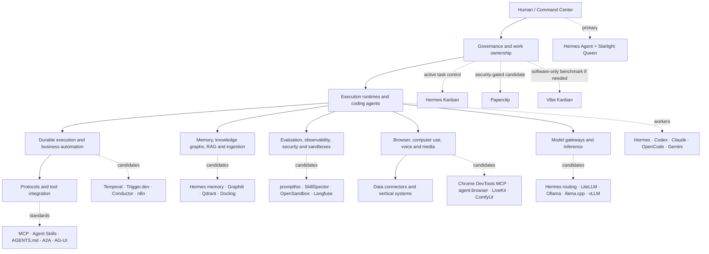
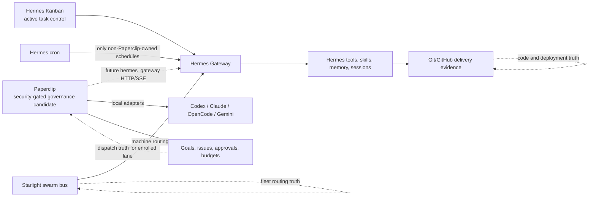

# Agentic Technology Knowledge Graph

The full graph is generated from the curated catalog and includes **every project** as a node, plus category, need, architectural-layer and recommendation nodes.

## Artifacts

- [`data/knowledge-graph.json`](../data/knowledge-graph.json) — canonical node/edge graph
- [`data/knowledge-graph-nodes.csv`](../data/knowledge-graph-nodes.csv) — importable node table
- [`data/knowledge-graph-edges.csv`](../data/knowledge-graph-edges.csv) — importable edge table
- [`data/projects.json`](../data/projects.json) — GitHub metadata snapshot
- [`data/catalog-seed.json`](../data/catalog-seed.json) — human-curated classification and recommendation source

Regenerate:

```bash
python scripts/refresh_catalog.py
python scripts/build_knowledge_graph.py
python scripts/render_catalog.py
```

## Architectural view



## Control and execution boundary



The self-loops in the diagram intentionally mean “remains its own source of truth.” Paperclip should not silently replace Git/GitHub or the Starlight fleet bus.

## Graph model

### Node types

| Type | Meaning |
|---|---|
| `project` | A GitHub repository in the current catalog |
| `category` | Primary product/architecture role assigned by this repository |
| `need` | An operational outcome from the needs map |
| `layer` | Broad architecture layer |
| `priority` | Local recommendation such as `adopt-core`, `pilot`, `evaluate` or `watch` |

### Edge types

| Type | Source → target | Meaning |
|---|---|---|
| `classified-as` | project → category | Project's primary role in this catalog |
| `recommended-as` | project → priority | Current local adoption posture |
| `serves` | category → need | Operational need addressed by the category |
| `belongs-to` | need → layer | Architecture layer containing that need |

## Query examples

The JSON is intentionally simple enough for `jq`, Python, NetworkX, DuckDB, Neo4j or a frontend graph viewer.

Questions the graph can answer:

- Which Rust projects serve execution, state, browser or sandbox needs?
- Which projects marked `pilot` require license review?
- Where do two candidate systems occupy the same category and risk duplication?
- Which needs have no `adopt-core` or `adopt-adjacent` project?
- Which projects are above the star threshold but only in `watch` status?

## Limits

- A project currently has one primary category, even when it spans several capabilities.
- GitHub stars and metadata are a time-stamped discovery snapshot.
- `NOASSERTION` and `OTHER` are license-review flags, not proof that a project lacks a license.
- The graph captures architectural fit, not benchmark results, security approval or production readiness.
- Recommendation values are specific to Frank's estate and should not be presented as universal rankings.
