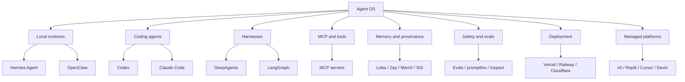

# Landscape Map

## Layer Definitions

| Layer | Definition |
| --- | --- |
| Local runtime | Runs agent work on a user's machine or private infrastructure |
| Coding agent | Reads, edits, tests, and reviews code |
| Harness | Structures long-running or multi-agent execution |
| MCP/tool protocol | Connects models/agents to tools and data |
| Memory/provenance | Records state, recall, traces, and decisions |
| Safety/eval | Tests, constrains, or monitors agent behavior |
| Deployment | Hosts apps, APIs, gateways, dashboards, or workers |
| Managed platform | Productized agentic creation or operation surface |
