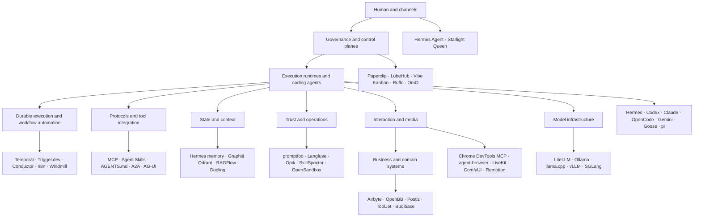

# Landscape Map

This compact map organizes the catalog by architectural responsibility. The complete project-level graph is in [Knowledge Graph](knowledge-graph.md).

```mermaid
flowchart TB
  H[Human and channels] --> G[Governance and control planes]
  G --> E[Execution runtimes and coding agents]
  E --> D[Durable execution and workflow automation]
  E --> P[Protocols and tool integration]
  E --> S[State and context]
  E --> T[Trust and operations]
  E --> I[Interaction and media]
  E --> M[Model infrastructure]
  I --> B[Business and domain systems]

  H --> H1[Hermes Agent · Starlight Queen]
  G --> G1[Paperclip · LobeHub · Vibe Kanban · Ruflo · OmO]
  E --> E1[Hermes · Codex · Claude · OpenCode · Gemini · Goose · pi]
  D --> D1[Temporal · Trigger.dev · Conductor · n8n · Windmill]
  P --> P1[MCP · Agent Skills · AGENTS.md · A2A · AG-UI]
  S --> S1[Hermes memory · Graphiti · Qdrant · RAGFlow · Docling]
  T --> T1[promptfoo · Langfuse · Opik · SkillSpector · OpenSandbox]
  I --> I1[Chrome DevTools MCP · agent-browser · LiveKit · ComfyUI · Remotion]
  M --> M1[LiteLLM · Ollama · llama.cpp · vLLM · SGLang]
  B --> B1[Airbyte · OpenBB · Postiz · ToolJet · Budibase]
```

## Layer definitions

| Layer | Responsibility | Source of truth rule |
|---|---|---|
| Human and channels | Conversation, command, notification and human decisions | One primary receive gateway per human channel |
| Governance | Goals, ownership, hierarchy, approvals, budgets and task state | One dispatcher/owner per enrolled workflow |
| Execution | Reasoning, tools, files, browser, coding, skills and sessions | Runtime evidence plus bounded workspace |
| Durable coordination | Timers, events, retries, long jobs and business integrations | One scheduler per workflow |
| Interoperability | Portable tools, skills, messages and UI events | Prefer stable protocols over custom adapters |
| State and context | Memory, knowledge, retrieval, ingestion and provenance | Git/domain SSOT beats generated memory |
| Trust and operations | Tests, evals, traces, costs, secrets and containment | Fail closed on security, money and production gates |
| Interaction and media | Browser, desktop, voice, image and video actions | Real exports and visual/behavioral QA prove results |
| Model infrastructure | Provider routing, inference, serving and fallback | Provider billing remains spend truth |
| Business and domain | Data connectors and vertical operating systems | Domain-specific repositories and ledgers remain authoritative |

## Boundary rule

The landscape is composable, not cumulative. Installing one project from every box would create duplication. Select the smallest stack that gives each responsibility one accountable owner, then add adjacent primitives only when a measured gap appears.